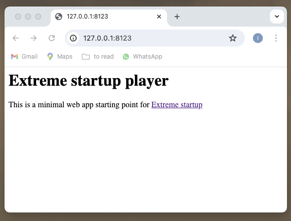

This is a starting point for a Java player of the Extreme Startup game devised by [Robert Chatley](https://github.com/rchatley).

	“teams can compete to build a software product that satisfies market demand.” (Rob Chatley)

# Steps to get started

1. Login to https://github.com/
2. Fork this repo
3. Clone your fork on your machine:
    - ```git clone git@github.com:<your-username>/extreme_startup_player.git```
4. Make sure you can build the service on your machine:
    - ```./gradlew build```
5. _Optionally_, you can run the service on your machine:
    - ```./gradlew run```
    - open http://127.0.0.1:8123/
    - You should see:
      - 
    - <code style="color:red">Stop the server</code>

## Deploying the service

For this lab we will use https://fly.io/

This is a commercial product - I have no affiliation with it, it’s just useful for the lab.

### Install the Fly.io CLI

First, check to see whether you have the "fly" CLI already installed.

If executing this:
```bash
flyctl
```
prints something like this (truncated here):
```
This is flyctl, the Fly.io command line interface.

Usage:
  flyctl [flags]
  flyctl [command]
...
```
then the "fly" CLI is already installed.

Otherwise:
```bash
brew install flyctl
```

### login to fly

For this you will need a username and password which I will give you.

1. Login to fly 
```bash
fly auth login
```
2. Edit fly.toml so your service gets a unique URL (for example):
```bash
sed -i .back "s/extreme-startup-player/extreme-startup-player-$USER/g" fly.toml
```
3. commit and push this change
4. "Launch" the app to deploy it for the first time to Fly.io - you only have to do this once
```bash
fly launch
```
Answer the questions as below:
```
Would you like to copy its configuration to the new app? (y/N)
y

Do you want to tweak these settings before proceeding? (y/N)
n
```
If this has worked, you should see a message like:
```text
Visit your newly deployed app at https://extreme-startup-player-ivan.fly.dev/
```
5. deploy to fly with "deploy" instead of "launch"
```bash
fly deploy
```
6. Open a browser on the URL of the deployed service
```bash
open "https://extreme-startup-player-$USER.fly.dev/"
```
7. Set up GitHub Actions CD pipeline:
   - Generate a token for Fly.io
```bash
fly tokens create deploy -x 999999h
```
   - Go to the GitHub “Settings” for your repository where you’ll find “Secrets and variables” and click on “Actions”
   - In the “Repository Secrets” section, add “New repository secret” with name FLY_API_TOKEN and the value as just generated.
   - Make sure your pipeline setup is working by making a change to the HTML in the class HomePage and seeing that it changes in the deployed service.
8. Join the game, see: https://extreme-startup.fly.dev/ (you will be given the `game id` in the lab)

# Troubleshooting

### debug running app

```bash
fly logs
```

## Docker

Fly.io builds and runs your service as a Docker container.
You can replicate what it is doing on your machine if you have Docker installed.

1. build docker image
```bash
docker build -t extreme_startup_player .
```
2. run docker container based on that image
```bash
docker run -p 8123:8123 --name extreme_startup_player extreme_startup_player
```
3. See it running: http://localhost:8123/
4. run docker container based on that image
```bash
docker rm -f extreme_startup_player
```
5. cleanup
```bash
docker container prune -f
```
